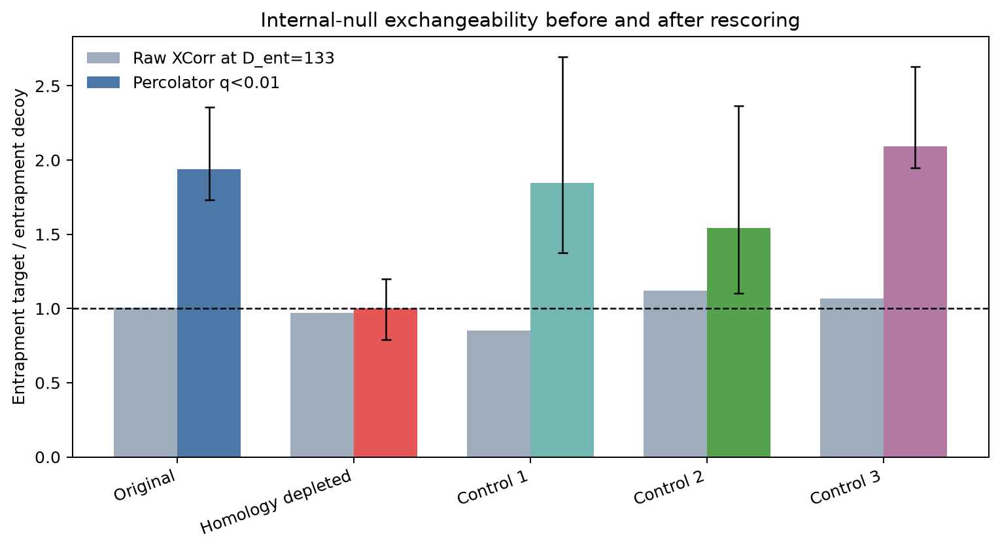
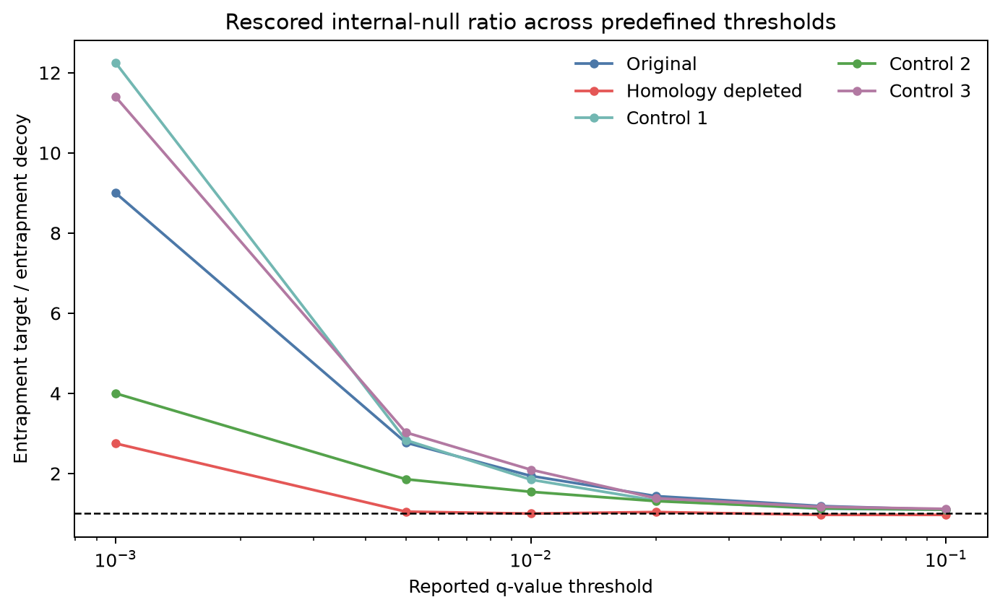
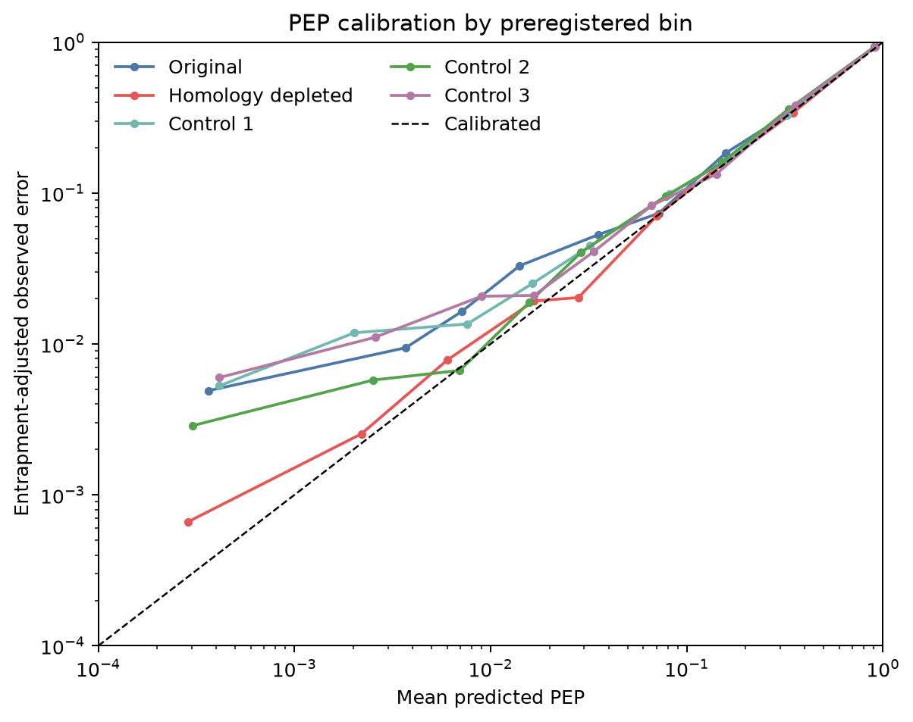
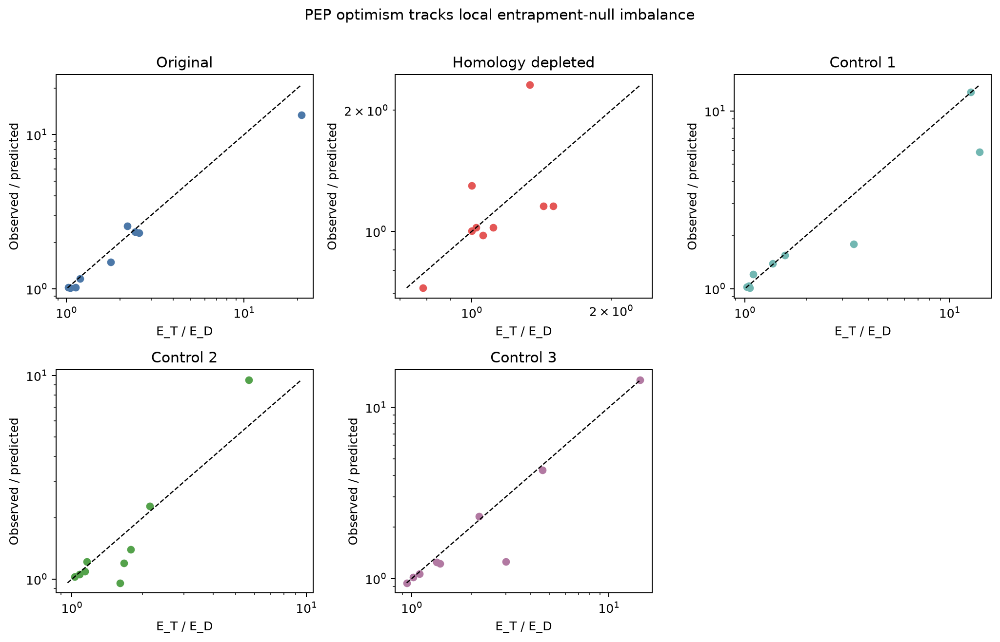
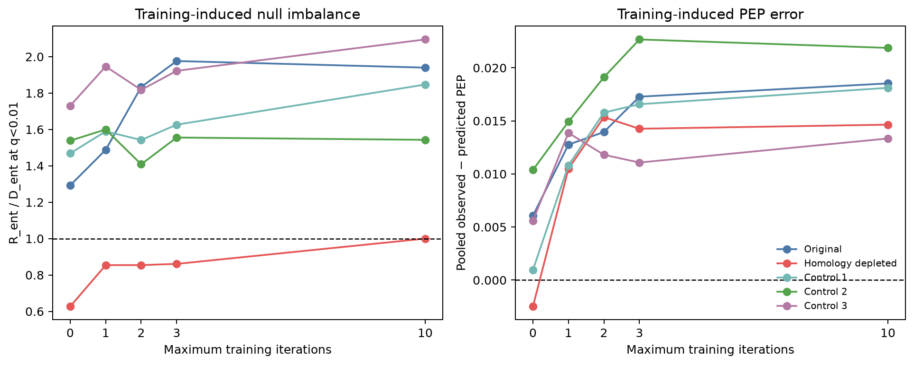

# Final report: pre-search homology-depleted entrapment

## Conclusion

**Near-homology hypothesis: SUPPORTED.**

Yes: in this dataset, biologically structured false targets residing in
proteins capable of producing highly native-homologous peptides are a causal
reason reversed decoys fail to represent the high-scoring false-target
distribution after Percolator rescoring. Pre-search homology depletion changed
the primary q<0.01 internal-null ratio from 258/133 = 1.940 to 102/102 = 1.000.
Three comparably depleted random controls remained at 1.543--2.095 (mean
1.828). Raw XCorr was already approximately exchangeable in every condition,
so the distinctive effect appears in the semi-supervised rescored tail rather
than as a general raw-search imbalance.

The result is not classified STRONGLY SUPPORTED because the preregistration
required the homology effect to exceed every individual control's uncertainty
and show concordant PEP/FDP improvement. The paired contrast against control
155921 has a 95% run-bootstrap interval that barely crosses zero, and pooled
PEP-error contrast intervals also cross zero. The primary contrast against the
mean control and the FDP contrasts do not.

For the q<0.01 null-imbalance/FDP failure in this dataset, classification **A:
near-homology is the dominant cause** is supported: the intervention removed
100% of the original ratio excess above one, while the mean size-control change
accounts descriptively for 11.9% and the homology-specific contrast for 88.1%.
For the broader all-PEP calibration defect, classification **B: near-homology
is one important contributor among several** is better supported because a
positive pooled PEP error remains and the enzN/enzC effect largely persists.
Search-space explanation C is not supported.

## Primary endpoint and negative controls

| condition | accepted targets | R_ent | D_ent | R_ent/D_ent | adjusted FDP | direct known-false |
|---|---:|---:|---:|---:|---:|---:|
| original | 19,545 | 258 | 133 | 1.940 | 1.687% | 1.320% |
| homology depleted | 20,089 | 102 | 102 | 1.000 | 0.880% | 0.508% |
| size control 130363 | 20,512 | 205 | 111 | 1.847 | 1.678% | 0.999% |
| size control 155921 | 20,141 | 162 | 105 | 1.543 | 1.349% | 0.804% |
| size control 196613 | 20,444 | 199 | 95 | 2.095 | 1.634% | 0.973% |

The mean control ratio is 1.828. The preregistered log contrast of homology
depletion versus the mean controls is -0.596; its six-run paired bootstrap 95%
interval is [-0.955, -0.215], with all 10,000 replicates below zero. Ratio
intervals are original [1.734, 2.356], homology depleted [0.789, 1.200], and
1.101--2.698 across individual controls. Individual paired log-contrast
intervals are [-1.003, -0.170], [-1.027, +0.078], and [-1.061, -0.527].

At the frozen raw XCorr depth D_ent=133, the ratios are original 134/133 =
1.008, homology depleted 129/133 = 0.970, and controls 0.850, 1.120, and 1.068.
There is no distinctive raw-stage homology benefit. All 30 searches were fresh
Comet searches from raw spectra with condition-specific regenerated decoys;
the effect cannot be a post-search filter, reused-decoy artifact, or changed
target/decoy label rule.

## FDP calibration

FDP calibration improved substantially. At q<0.01 the adjusted FDP fell from
1.687% to 0.880%, an absolute reduction of 0.807 percentage points (47.8%). The
homology-minus-original paired run-bootstrap interval is [-1.136, -0.514]
percentage points; the homology-minus-mean-control interval is [-1.174, -0.227]
points. The direct known-false lower bound fell from 1.320% to 0.508%.

The improvement is not confined to the primary cutoff. Homology-depleted
adjusted FDPs are 0.418%, 0.880%, 1.907%, 4.470%, and 8.936% at q<0.005, 0.01,
0.02, 0.05, and 0.10. The q<0.001 region is sparse (11 entrapment targets and
4 decoys; adjusted FDP 0.144%) and remains inconclusive rather than evidence of
complete extreme-tail calibration. The full threshold table is
`tables/q_thresholds.tsv`.

## PEP calibration

PEP calibration improved, most clearly in the high-confidence region, but did
not become globally calibrated. Pooled adjusted observed-minus-predicted PEP
error changed from +0.01853 to +0.01464, a 21.0% reduction. The three control
errors are +0.01812, +0.02188, and +0.01334 (mean +0.01778). Thus the homology
arm improves over the control mean by 0.00313, but not over every individual
control. The paired run-bootstrap intervals are [-0.01428, +0.00057] for
homology minus original and [-0.01724, +0.00243] for homology minus the control
mean. These intervals make the pooled improvement suggestive, not decisive.

For cumulative PEP<0.01, where the prior near-homolog enrichment was found,
the original arm has mean predicted PEP 0.00163 and adjusted observed fraction
0.00685 (residual +0.00522; observed/predicted 4.19). Homology depletion has
mean predicted 0.00105 and adjusted observed 0.00148 (residual +0.00043;
observed/predicted 1.41), with entrapment counts falling from 82/19 to 13/10.
All frozen bins, counts, direct Wilson intervals, adjusted fractions, and
residuals are in `tables/pep_calibration.tsv`.

## Bin-level shared-cause relationship

The fresh original arm independently reproduces the quantitative relationship:
across its nine populated bins, Pearson correlation between
log(observed/predicted) and log(R_ent/D_ent) is 0.9918, with 10.7% median fold
residual. The prior frozen run was 0.9981 with 5.1% residual. The difference is
concentrated in sparse lowest-PEP bins after the recorded Comet tie-rank
variation; both estimates show the same close relationship.

Controls retain correlations of 0.940--0.955 and median fold residuals of
2.1--6.7%. In the homology-depleted arm the correlation falls to 0.602 because
the intervention compresses most bin ratios close to one, leaving little
dynamic range; its median fold residual remains only 8.8%. Thus the approximate
one-to-one factorization survives, while ordinary Pearson correlation becomes
range-limited. E_T/E_D and PEP optimism decline together in the confident bins,
supporting a shared causal null-imbalance mechanism.

## Training-induced amplification

Homology depletion weakens the previously observed training-induced
amplification of target/decoy imbalance, but not the rise in pooled PEP error.

| condition | metric | maxiter 0 | maxiter 10 |
|---|---|---:|---:|
| original | R_ent/D_ent | 1.293 | 1.940 |
| homology depleted | R_ent/D_ent | 0.627 | 1.000 |
| original | pooled PEP error | +0.00607 | +0.01853 |
| homology depleted | pooled PEP error | -0.00249 | +0.01464 |
| original | accepted targets | 11,731 | 19,545 |
| homology depleted | accepted targets | 12,128 | 20,089 |

In the original arm, training moves the internal null farther from one; in the
homology arm it moves the ratio toward one. However, pooled PEP optimism still
increases with training in the depleted arm. Near-homology therefore explains
the training-amplified high-confidence imbalance but is not sufficient to
explain every component of pooled PEP error.

## Seed reproducibility and enzN/enzC interaction

At q<0.01, Percolator seeds 1--3 give original ratios 1.940, 1.863, and 1.970;
homology-depleted ratios are 1.000, 1.020, and 0.912. The result is not a
seed-1 artifact. These ranges measure algorithmic reproducibility, not
biological confidence intervals.

Removing enzN/enzC changes the original ratio from 1.940 to 1.602 and the
homology ratio from 1.000 to 0.833. The ratio multipliers are nearly identical
(0.826 and 0.833), which is most consistent with largely independent mechanisms.
Pooled PEP error falls from +0.01853 to +0.00848 original and from +0.01464 to
+0.00686 depleted, so some overlap in calibration impact remains possible.
This is a causal diagnostic only and does not select production features.

## What remains unexplained

The intervention restores q<0.01 exchangeability and produces ratios close to
one from q<0.005 through q<0.10, but four limitations prevent a claim that the
entire problem is solved:

1. Pooled PEP error remains +0.01464 and its improvement is not decisive under
   the six-run bootstrap.
2. The very-low-count q<0.001 tail remains uncertain.
3. Whole-protein deletion removes non-witness peptides and changes biological
   composition; the causal treatment is the homolog-bearing protein set, not a
   peptide-isolated manipulation. The homology arm also has 5.59% fewer unique
   searchable peptides than the random-control mean.
4. One dataset family cannot quantify dataset-level or organism-level
   uncertainty.

Exploratory inspection of the 102 remaining homology-arm entrapment targets and
102 decoys at q<0.01 finds no residual enrichment for the exploratory native
substring distance-at-most-two property: 9/80 distinct target peptides versus
13/79 decoy peptides. Score, PEP, peptide length, XCorr, mass, charge, enzyme
termini, and feature summaries are broadly similar. No new filter was built.
The residual mechanism is therefore unresolved rather than post hoc reassigned.

## Production decision

No evidence from this experiment justifies changing production
`percolator-rs`. The experiment validates a failure mode of the reversed-decoy
null model under this biological database construction; it does not establish
a generally valid homolog-removal rule, a new PEP estimator, or a production
correction. Production statistical methodology remains unchanged.

## Answers to the registered questions

1. **Did pre-search homology depletion reduce R_ent/D_ent?** Yes, 1.940 to
   1.000 at the primary endpoint.
2. **Was the reduction larger than size-matched random depletion?** Yes versus
   the preregistered control mean and all three point estimates; uncertainty
   against one individual control is borderline.
3. **Did PEP calibration improve?** Yes in the confident region and modestly
   when pooled; pooled uncertainty still includes no improvement.
4. **Did FDP calibration improve?** Yes, clearly and across the useful q range.
5. **Did training-induced amplification weaken?** Yes for internal-null
   imbalance; no for the training-associated rise in pooled PEP error.
6. **Did the bin relationship persist?** Yes as an approximate one-to-one
   factorization; Pearson correlation attenuates after depletion because the
   intervention removes its dynamic range.
7. **How much is attributable to near-homolog false targets?** Descriptively,
   100% of the q<0.01 ratio excess was removed; 88.1% is beyond the mean random
   size-control change. This estimate applies to the homolog-bearing protein
   treatment in this dataset, not universally.
8. **What remains unexplained?** Residual pooled PEP optimism, the sparse
   extreme tail, and dataset-level generality.
9. **Does this justify changing production?** No.
10. **Most informative next experiment?** Prospectively repeat the frozen
    paired design on independent biological datasets, using equal-opportunity
    close- and distant-phylogeny entrapment panels at predeclared homology
    strata. A monotone post-rescoring R_ent/D_ent response to biological
    distance, replicated across datasets, would test both generality and dose
    while separating homology from simple database size.

The machine-readable source of all reported values is
`analysis/rescored_results.json`; artifact hashes and exact paths are in
`ARTIFACT_MANIFEST.json`.
